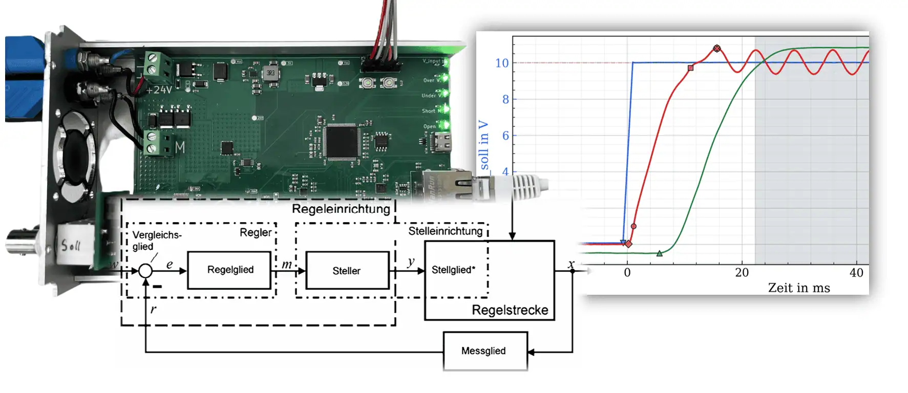
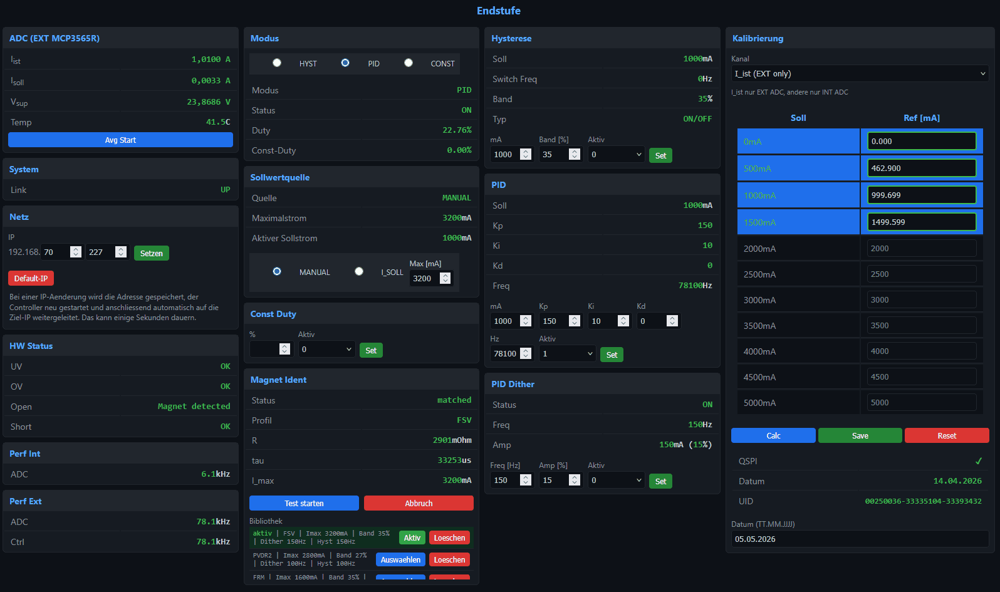
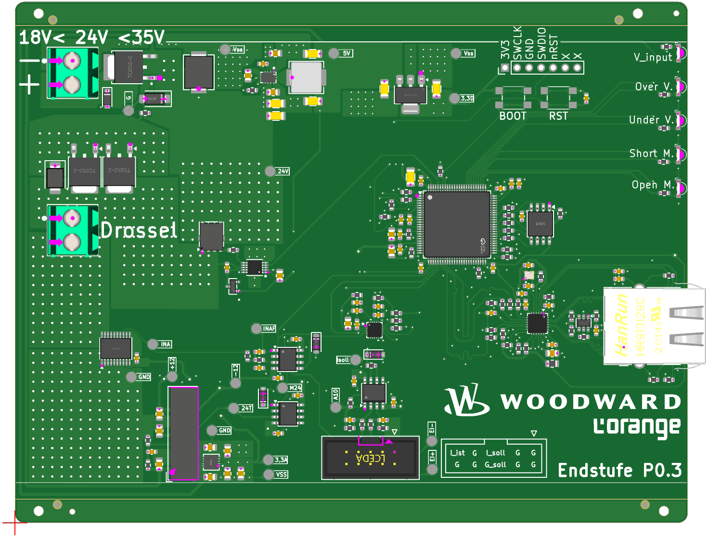
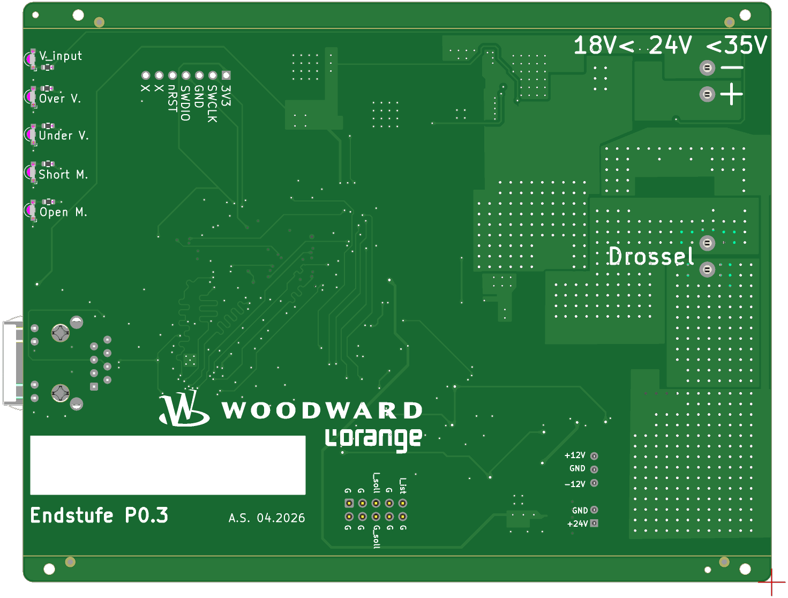

	
	&nbsp;&nbsp;&nbsp;&nbsp;
	
	&nbsp;&nbsp;&nbsp;&nbsp;
	

<h1 align="center">Digital Proportional Solenoid Driver</h1>

<strong>Embedded power electronics showcase for digital current control of proportional solenoid valves.</strong>

	
	
	
	
	

	

---

## 🎓 Project Snapshot

This repository is a compact public showcase of my master's thesis project: a custom high-current driver platform for proportional solenoid valves. The system was built to compare digital current-control strategies on real hardware and benchmark them against an analog reference.

---

## ✨ Highlights

<table align="center">
<tr>
<td align="center"><strong>⚡ Multi-Channel PWM</strong> Independent actuator channels with a wide usable frequency range</td>
<td align="center"><strong>🛡️ High-Side Power Stage</strong> LTC7001 gate driver with MOSFET output stage for solenoid loads</td>
<td align="center"><strong>🎯 Precision Current Sensing</strong> INA253A3 and MCP3565R measurement path for control and validation</td>
</tr>
<tr>
<td align="center"><strong>🧠 Bare-Metal Firmware</strong> STM32H7 service architecture without RTOS overhead</td>
<td align="center"><strong>🌐 Ethernet Telemetry</strong> Browser-based live dashboard for lab use and diagnostics</td>
<td align="center"><strong>💾 Persistent Calibration</strong> Stored correction data for repeatable current measurements</td>
</tr>
<tr>
<td align="center"><strong>🧲 Solenoid Profiles</strong> Parameter sets for actuator-specific behavior and test setup</td>
<td align="center"><strong>📈 Control Comparison</strong> Hysteresis, PID, and analog reference evaluated on the same hardware</td>
<td align="center"><strong>🔬 Measurement Workflow</strong> Prototype bring-up, calibration, test bench data, and result analysis</td>
</tr>
<tr>
<td align="center"><strong>🧰 Flash & Calibration Tooling</strong> Guided setup workflows for firmware deployment and device-specific calibration</td>
<td align="center"><strong>🚀 Application-Oriented Integration</strong> Support tooling that moves the platform beyond a pure lab prototype</td>
<td align="center"><strong>⚙️ Engineering Usability</strong> Designed for repeatable setup, validation, and practical handover</td>
</tr>
</table>

---

## 🛠️ What I Built

- ⚡ A multi-channel digital driver for proportional magnetic actuators.
- 🧩 A custom KiCad PCB with MCU, Ethernet, measurement chain, and power stage.
- 🧠 Bare-metal STM32 firmware for PWM, ADC, control loops, calibration, and diagnostics.
- 🌐 A browser-based interface for live telemetry, parameterization, and test support.
- 🧰 A calibration script and guided flash tool to support practical device setup and application-oriented integration.
- 📈 Measurement workflows to compare hysteresis control, PID control, and an analog reference.

---

## 🌐 Web Interface

	

The web interface made the prototype practical in the lab: live values, control settings, calibration views, and diagnostic information were available directly from a browser. In this public repository, operational details are intentionally kept high-level.

---

## 🧰 Integration Tooling

An important part of the project was not only the control hardware itself, but also the tooling around it. A calibration script and a guided flash tool were used to make firmware deployment, parameter transfer, and device setup more application-oriented and easier to integrate into real engineering workflows.

---

## 🔌 Hardware Prototype

> **Current hardware platform: Prototype P0.3** — final hardware revision.

<table>
<tr>
<td align="center"> P0.3 top: STM32H7, Ethernet PHY, power stage, measurement path</td>
<td align="center"> P0.3 bottom: status LEDs and resistor network</td>
</tr>
</table>

<table align="center">
<tr>
<th>Area</th>
<th>Implemented with</th>
<th>Purpose</th>
</tr>
<tr>
<td align="center">Control MCU</td>
<td align="center"><strong>STM32H750VBT6</strong></td>
<td>Real-time control, acquisition, and communication</td>
</tr>
<tr>
<td align="center">Current feedback</td>
<td align="center"><strong>INA253A3 + MCP3565R</strong></td>
<td>Precise current measurement for control and validation</td>
</tr>
<tr>
<td align="center">Power output</td>
<td align="center"><strong>LTC7001 + AGM12N10A</strong></td>
<td>High-side switching of proportional solenoid loads</td>
</tr>
<tr>
<td align="center">Connectivity</td>
<td align="center"><strong>LAN8742A Ethernet PHY</strong></td>
<td>Telemetry, diagnostics, and browser-based interaction</td>
</tr>
</table>

---

## 📈 Control Comparison

<table align="center">
<tr>
<th>Strategy</th>
<th>Main idea</th>
<th>Why it mattered</th>
</tr>
<tr>
<td align="center"><strong>Hysteresis</strong></td>
<td>Switch inside a defined current band</td>
<td>Fast, robust, simple behavior</td>
</tr>
<tr>
<td align="center"><strong>PID</strong></td>
<td>Closed-loop control with defined PWM behavior</td>
<td>Tunable response and fixed-frequency operation</td>
</tr>
<tr>
<td align="center"><strong>Analog reference</strong></td>
<td>Established non-digital baseline</td>
<td>Practical benchmark for evaluation</td>
</tr>
</table>

---

## 🗺️ Roadmap

- ✅ Hardware P0.1 (Nov 2025) and **P0.2** (Jan 2026) manufactured
- ✅ Bring-up and validation of P0.1 (Jan 2026) and P0.2 (Feb 2026)
- ✅ Firmware baseline completed: HAL, PWM, ADC + DMA, Ethernet
- ✅ Control strategies implemented (hysteresis, PID, analog) - March 2026
- ✅ Measurement series recorded - March 2026
- ✅ **Validation against the analog reference** completed - April 2026
- ✅ Final revision **P0.3** ordered - May 2026
- 🛠️ Integration into test bench systems

---

## 🧠 Skills Demonstrated

<table align="center">
<tr>
<td align="center"><strong>Embedded C</strong> Bare-metal STM32H7 services</td>
<td align="center"><strong>PCB Design</strong> KiCad, power stage, sensing path</td>
<td align="center"><strong>Control Engineering</strong> Hysteresis, PID, actuator behavior</td>
</tr>
<tr>
<td align="center"><strong>Measurement</strong> ADC chains, calibration, validation</td>
<td align="center"><strong>Networking</strong> Ethernet telemetry and web UI</td>
<td align="center"><strong>System Thinking</strong> Prototype, tooling, tests, documentation</td>
</tr>
</table>

---

## 📁 Repository Scope

This is a public, documentation-focused portfolio repository. It summarizes the technical work without publishing the full private development repository, detailed internal tooling, or complete experimental data.

Master's thesis project at <strong>KIT IPEK</strong> in cooperation with <strong>Woodward L'Orange</strong>.

